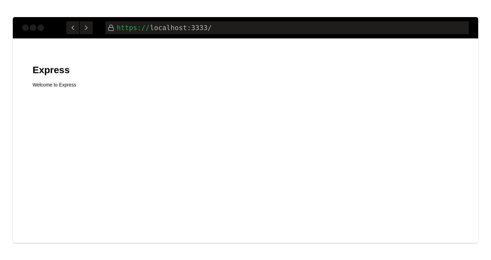

## :whale: Docker Image Node + Express
> Script automatizado para criar containers Node + Express
### Como executar
#### Por Shell Script
1. Fazer build da imagem
```sh
docker build -t imagemnode .
```

2. Tornar Scripts executáveis
```sh
chmod +x start.sh
chmod +x up.sh
chmod +x down.sh
```

3. Subir container
```sh
./up.sh
```

4. Excluir containers
```sh
./down.sh
```

#### Docker Compose
1. Executar docker compose
```sh
docker-compose up -d
```

2. Exluir containers
```sh
docker-compose down
```

### Screenshot


### Por que utilizar Docker?

#### 1. Ambientes Semelhantes
Uma vez que sua aplicação seja transformada em uma ima-
gem Docker, ela pode ser instanciada como container em
qualquer ambiente que desejar. Isso significa que poderá uti-
lizar sua aplicação no notebook do desenvolvedor da mesma
forma que seria executada no servidor de produção.

#### 2. Aplicação como pacote completo
Utilizando as imagens Docker é possível empacotar toda
sua aplicação e dependências, facilitando a distribuição, pois
não será mais necessário enviar uma extensa documentação
explicando como configurar a infraestrutura necessária para
permitir a execução, basta disponibilizar a imagem em repo-
sitório e liberar o acesso para o usuário e, ele mesmo pode
baixar o pacote, que será executado sem problemas.

#### 3. Padronização e replicação
Como as imagens Docker são construídas através de arquivos
de definição16, é possível garantir que determinado padrão
seja seguido, aumentando a confiança na replicação. Basta
que as imagens sigam as melhores práticas17 de construção
para que seja viável escalarmos18 a estrutura rapidamente.

#### 4. Idioma comum entre Infraestrutura e desenvolvimento
A sintaxe usada para parametrizar as imagens e ambientes
Docker pode ser considerada um idioma comum entre áreas
que costumeiramente não dialogavam bem. Toda a infraestrutura estará presente no código, e basta um pull request para mudá-la.

#### 5. Comunidade
Assim como é possível acessar o github19 ou gitlab20 à procura
de exemplos de código, usando o repositório de imagens do
Docker21 é possível conseguir bons modelos de infraestrutura
de aplicações ou serviços prontos para integrações complexas.

### Legal, mas o que é Docker?
É uma ferramenta para provisionar aplicações o mais rápido possível.